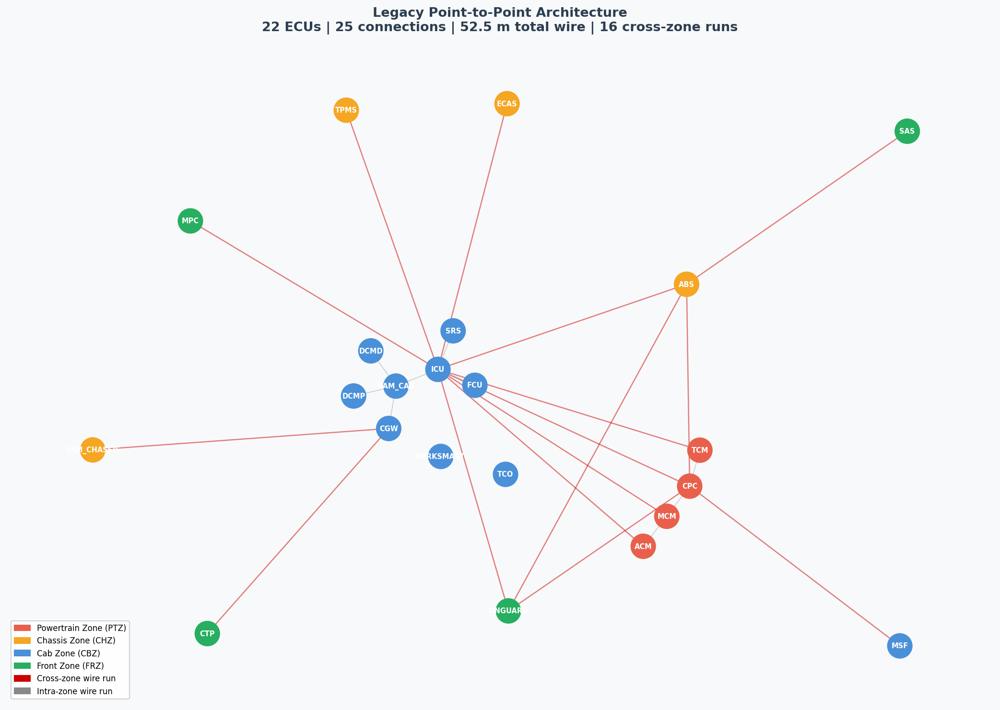
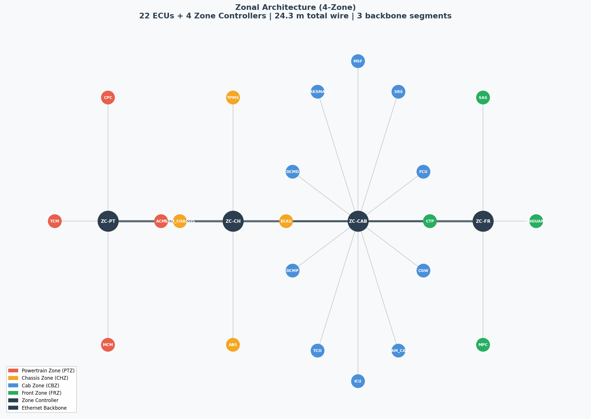
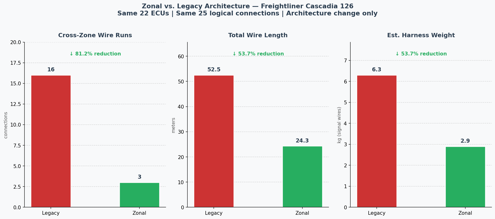

# Zonal E/E Architecture Analyzer
### A Python tool that quantifies the complexity reduction of transitioning a Freightliner Cascadia Class 8 truck from legacy point-to-point wiring to a 4-zone Ethernet architecture.

---

## Background

Modern Class 8 trucks carry 70–100+ Electronic Control Units (ECUs). In the traditional **domain/point-to-point architecture**, every ECU that needs to communicate with another gets its own dedicated wire running across the length of the truck. The result is a wiring harness that can weigh 70+ kg, span several kilometers, and become increasingly difficult to manufacture, route, and service.

The industry is transitioning to **Zonal Architecture** — ECUs are grouped by physical location into zones, each served by a local Zone Controller. Zone Controllers communicate over a single high-speed Ethernet backbone. This dramatically reduces individual long wire runs.

**The problem:** No open-source tool exists to model a specific truck's ECU layout, run both topologies as graphs, and produce a quantified, visual comparison. This tool fills that gap.

---

## Results — Freightliner Cascadia 126 (2020)

> Same 22 ECUs. Same 25 logical connections. Architecture change only.

| Metric | Legacy (point-to-point) | Zonal (4-zone) | Reduction |
|---|---|---|---|
| Cross-zone wire runs | 16 | 3 | **81.2% fewer** |
| Total wire length | 52.5 m | 24.3 m | **53.7% saved** |
| Est. harness weight | 6.3 kg | 2.9 kg | **3.4 kg saved** |

---

## Output diagrams

### Legacy point-to-point topology


### Zonal architecture (4-zone)


### Metric comparison


---

## Data sources

All ECU data is sourced from publicly available official documents — no proprietary OEM data is used.

| Source | Used for |
|---|---|
| **DTNA SS-1033423** — J-1939 Fault Code Source Address Descriptions. Daimler Trucks North America. Available via NHTSA public database. | Complete ECU list with J1939 source addresses |
| **DTNA STI-503** — NGC sSAM, VPDM & BCA Wall Chart. Rev. Q, March 2020. Available via Freightliner content server. | Physical ECU location and zone assignment |
| **Freightliner New Cascadia Electrical System Overview** | CAN network segmentation (Powertrain CAN, Chassis CAN, Cabin CAN) |
| **Park C, Cui C, Park S.** Analysis of E2E Delay and Wiring Harness in In-Vehicle Network with Zonal Architecture. *Sensors* 2024;24(10):3248. DOI: 10.3390/s24103248 | Academic validation of representative-model methodology |

Wire length estimates are based on Freightliner Cascadia 126 published chassis dimensions (~8.5m cab length). Harness weight uses 120 g/m bundled average for signal-wire harnesses.

---

## Architecture

```
cascadia_126_2020.yaml          ← truck config (ECUs, zones, connections)
        ↓
src/parser.py                   ← reads YAML → Python dict
        ↓
src/graph.py                    ← builds two NetworkX graphs (legacy + zonal)
        ↓
src/metrics.py                  ← calculates wire length, weight, connection counts
        ↓
src/visualize.py                ← generates 3 PNG outputs via matplotlib
        ↓
outputs/                        ← legacy_topology.png, zonal_topology.png, comparison_chart.png
```

---

## Tech stack

| Library | Purpose |
|---|---|
| `PyYAML` | Parse the truck config file into Python data structures |
| `NetworkX` | Build and store the legacy and zonal graphs; compute edge weights |
| `Matplotlib` | Render topology diagrams and comparison bar chart |
| `Tabulate` | Print formatted comparison table to terminal |

---

## How to run

**1. Clone the repo**
```bash
git clone https://github.com/YOURUSERNAME/zonal-ee-analyzer.git
cd zonal-ee-analyzer
```

**2. Install dependencies**
```bash
pip install -r requirements.txt
```

**3. Run the full pipeline**
```bash
python main.py
```

Or pass a different config file:
```bash
python main.py configs/cascadia_126_2020.yaml
```

**4. Check outputs**

Three PNG files are generated in the `outputs/` folder:
- `legacy_topology.png` — network diagram of legacy point-to-point architecture
- `zonal_topology.png` — hub-and-spoke zonal layout with Ethernet backbone
- `comparison_chart.png` — side-by-side bar chart of all three metrics

---

## Repository structure

```
zonal-ee-analyzer/
├── configs/
│   └── cascadia_126_2020.yaml    ← truck ECU config (data input)
├── src/
│   ├── parser.py                 ← YAML loader and validator
│   ├── graph.py                  ← NetworkX graph builder (legacy + zonal)
│   ├── metrics.py                ← wire length, weight, reduction calculator
│   └── visualize.py              ← diagram and chart generator
├── outputs/                      ← generated PNG files (auto-created)
├── main.py                       ← pipeline entry point
├── requirements.txt
└── README.md
```

---

## The truck model — Freightliner Cascadia 126 (2020)

22 ECUs across 4 physical zones:

| Zone | ECUs |
|---|---|
| **Powertrain Zone (PTZ)** — engine compartment | MCM, CPC, ACM, TCM |
| **Chassis Zone (CHZ)** — frame rails, mid-vehicle | ABS, ECAS, TPMS, SAM-Chassis |
| **Cab Zone (CBZ)** — driver interior, dash, sleeper | ICU, CGW, SAM-Cab, FCU, SRS, MSF, ParkSmart, DCMD, DCMP, TCO |
| **Front Zone (FRZ)** — front fascia and bumper | MPC, OnGuard, SAS, CTP |

Each zone would be served by a dedicated Zone Controller (ZC-PT, ZC-CH, ZC-CAB, ZC-FR) connected via a 100BASE-T1 Ethernet backbone in a zonal deployment.

---

## Novel angle — SPWH candidate flagging (Phase 2)

The tool is designed to be extended with a **Structural Printed Wiring Harness (SPWH) mode**: for every wire segment carrying less than 3A, it flags the connection as a candidate for replacement by a printed conductive trace on a structural panel, and computes required trace dimensions using IPC-2221 current-carrying capacity formulas. This directly supports feasibility analysis for next-generation harness elimination on door and cab panels.

---

## Context

Built as part of a personal R&D portfolio extending internship research at **Daimler Truck Innovation Center India (DTICI)**, where related work included KiCad door harness schematics, Zonal Ethernet Architecture research for Class 8 trucks (TSN, SOME/IP, J1939 bridging), and the Structural Printed Wiring Harness (SPWH) feasibility project for Freightliner and Western Star platforms under DTNA.

---

## License

MIT License — free to use, modify, and extend. Attribution appreciated.
